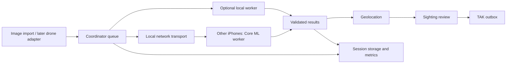

# RescueSwarm iPhone app design

Status: implementation blueprint, 2026-10-04. First-milestone Swift source and an Xcode
project now exist; see README.md and TEST_STATUS.md. No iOS build/device test has run yet.
The native app is now the intended product. Python remains a reference and test peer.

## Product outcome

A team imports drone images on one iPhone, joins nearby iPhones over local Wi-Fi,
processes the images together, reviews possible people, and shares located sightings
with TAK. Internet access is not required for image processing. Models and test images
must already be available on the devices. Live drone input is a later adapter.

One app, two roles. The coordinator can also contribute through an optional local
worker, using the same result path without sending image bytes across the network.
Start with that option off for clear performance comparisons; enable after measuring
its effect on responsiveness, battery and throughput.

## Screens and actions

| Screen | Main actions | States that must be visible |
|---|---|---|
| Home | Create session, join session, reopen saved session | No sessions; local network permission denied |
| Create / join | Name session; discover nearby coordinator; manual address fallback; accept joining device | Searching, waiting for acceptance, connected, incompatible version |
| Session | Import images, start/pause/stop, enable local processing, see worker list | Queued/completed/failed counts, throughput, disconnected or cooling workers |
| Worker | Join, pause contribution, leave | Current image, completed count, battery, thermal state, model loading/error |
| Sightings | Browse image thumbnails; open original image and box; filter review status | Unreviewed, confirmed, dismissed; location available/unavailable |
| Sighting detail | Review, inspect coordinate estimate, queue TAK share, retry failed share | Capture time vs receipt time; estimation method; uncertainty unknown; send status |
| Results / settings | Export metrics and sightings; choose comparison policy; configure TAK endpoint | Synthetic test label; export success/error; pending outbound messages |

Use large primary controls, readable text, accessible labels and status text alongside
colors. Never show a successful connection or delivery based on a button press alone.
Without an offline basemap, provide coordinates and the source image; do not depend
on fetching map tiles. A map is an enhancement, not a condition for reviewing results.

## Components

Use SwiftUI for screens. A Coordinator actor owns queue and assignment state so
concurrent network callbacks cannot accept a task twice. Network transport owns
connections and serialized framed writes. The detector runs outside the UI actor;
one inference at a time per worker initially. A local worker is a separate component,
not inference performed inside the coordinator actor.

Use Apple's Network framework for TCP and Bonjour discovery. Declare local-network
usage and the Bonjour service in Info.plist. Keep a manual endpoint option for Python
interoperability. The first developer build can use the existing v1 framing on a trusted
test LAN. Before the app's field-ready milestone, add authenticated encrypted transport
and deliberate device pairing; discovery and SHA-256 checks alone do not authenticate peers.
Do not silently make the Python v1 server accept a changed protocol.

Keep scheduler/data types in a Swift package independent of SwiftUI, Core ML and TAK.
Platform adapters implement the interfaces in INTERFACES.md. Use dependency injection
for the clock, transport, detector, storage and TAK sink so faults can be tested.

## Scheduling and recovery

- Default next-available: assign one task to each eligible idle worker. Faster workers
  naturally receive more tasks. Retain single and round robin for controlled comparisons.
- Tasks move queued -> assigned(attempt) -> accepted or retry/failed. Accept only the
  current session, task, attempt and image combination; execution may repeat, acceptance must not.
- Initial reference defaults: heartbeat every 0.2s, missing-peer timeout 3s, task deadline
  10s, maximum 3 attempts. Keep configurable and tune from actual device observations.
- Heartbeats do not extend a task deadline. Separate startup/model loading from processing.
- Bound memory by file-backed image storage and one in-flight image per worker. Start with
  the existing 16 MiB image and 64 KiB JSON limits; show an actionable error for larger input.
- Pause stops new assignments, lets valid in-flight results finish, and saves state.
  Stop cancels pending work explicitly; late callbacks cannot revive cancelled tasks.
- Persist imported image references, terminal results and attempts. After coordinator restart,
  invalidate old assignments, increment attempts before reassignment, and reconnect peers.
  Use transactional persistence for result acceptance. No automatic coordinator election initially.
- Mark workers unavailable when leaving/backgrounding. Checkpoint and reconnect on return.
  The foreground is the initial supported processing mode; indefinite background inference
  is not promised. Coordinator suspension pauses the session; results can be reconciled on return.

## Performance decisions

Distribute independent images rather than splitting one model across phones. This
keeps communication small relative to inference and avoids synchronization between layers.
Pipeline transfer on one connection with inference on other devices. Do not add multiple
inferences per phone until measurement demonstrates a benefit.

Use Core ML with computeUnits allowing the system to select available accelerators.
This does not guarantee simultaneous use of all CPU/GPU/Neural Engine resources.
Evi validates the converted model's outputs against reference images before timing it.
At serious thermal state, stop assigning new inference work until recovery; at critical,
pause processing and keep only necessary UI/state operations. Make battery participation
limits user-visible and configurable. These policies require device tests, not simulated claims.

Measure end-to-end batch time, first result, inference time, transfer bytes, queue wait,
retry count, per-worker tasks, sustained throughput and thermal/battery state. Compare
coordinator-only inference against remote single-worker and multi-worker policies using
the same inputs/model. First correct detection requires ground-truth matching. A larger
worker count is not an improvement if upload overhead or heat makes results slower.

## Milestones and ownership

| Stage | Deliverable and completion gate | Lead |
|---|---|---|
| 1. Native foundation | Xcode app shell, shared data types, role screens, framed transfer of one image and mock result between devices | Mohamed; teammate with Mac builds/tests |
| 2. Reliable coordinator | Swift queue/policies, retries, validation, pause/rejoin and bounded-memory tests | Mohamed |
| 3. Real detection | Core ML model loads offline; original-image boxes and timings match validated reference conventions | Evi |
| 4. Location and review | Telemetry adapter, missing-data handling, sighting review and tested TAK delivery path | Aidan; Mohamed connects UI/events |
| 5. Complete app | Persist/recover sessions, authenticated pairing, thermal/battery behavior, accessible error states and exports | All three |
| 6. Evidence and demo | Repeated on-device baselines, disconnect/background tests, reproducible build and demonstration | Mohamed coordinates; all three validate |

Stages 2-4 can develop against the same interfaces without waiting for each other's
finished implementation. Mock detectors remain available only in clearly labeled test sessions.
Live drone feed support follows these stages and depends on the selected drone/controller API.

## Build and verification boundary

Source and documents can be edited on Windows. The teammate's Mac/Xcode is needed
to build/sign/run the iOS app. Simulators help with screens and logic; two real iPhones
are the target gate for phone-to-phone discovery, transfer, battery/thermal and performance.
A phone plus the Windows Python peer is useful intermediate evidence, not that final gate.
Check the teammates' iOS versions before fixing the deployment target.

## Apple references checked for this design

- [Network framework](https://developer.apple.com/documentation/network): TCP connections and discovery APIs.
- [Local network privacy](https://developer.apple.com/documentation/technotes/tn3179-understanding-local-network-privacy): permission handling and Bonjour declarations.
- [Core ML compute units](https://developer.apple.com/documentation/coreml/mlcomputeunits): system selection of supported compute units.
- [Background strategies](https://developer.apple.com/documentation/backgroundtasks/choosing-background-strategies-for-your-app): background runtime is conditional; handle suspension.
- [Thermal state](https://developer.apple.com/documentation/foundation/processinfo/thermalstate-swift.enum): adapt workload to the device's reported state.
